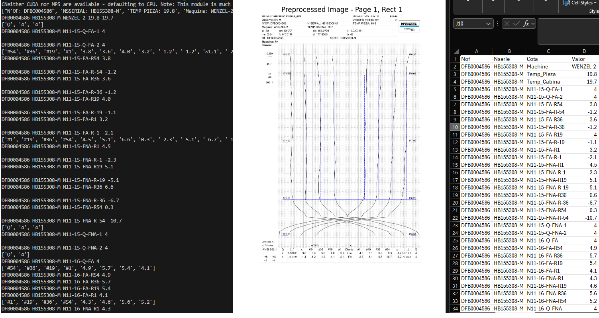

# MMT_OCR
Artificial Vision System to Metrology System Reports

    Created by Rafael A.H. in Apr. 2025
       
## Description

This program allows extracting text and table data from PDF files using computer vision and OCR (Optical Character Recognition) techniques. It was made as a solution to an encrypting problem with metrology reports where the data was impossible to extract by conventional methods.

This program indexes the extracted data and maps it to the representative measurement points, ensuring accurate correlation between the data and the corresponding metrics.

## Features

- **OCR with EasyOCR**: Uses EasyOCR for text recognition in images.
- **Image processing**: Converts PDF pages into high-resolution images (16k) to improve OCR accuracy.
- **Structured data extraction**: Identifies and extracts data from specific regions of PDF pages.
- **Support for multiple cases**: Handles PDF documents with varying numbers of pages and structures.
- **CSV export**: Saves extracted data into a CSV file for easy analysis.
- - **Extracts**: Machine and Cabin temp. Serial no. Job Order, and Metrology dimensions.

## Requirements

- Python 3.8 or higher
- Required libraries (installable with `pip`):
    - `PyMuPDF` 
    - `EasyOCR`
    - `OpenCV` (cv2)
    - `NumPy`
    - `Matplotlib`
    - `Tkinter` 
    - `csv`

